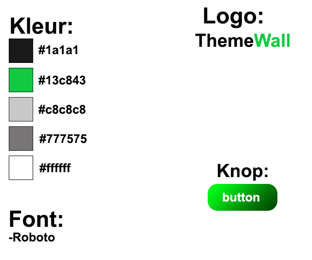

# TheWall
TheWall is een social media platform waar gebruikers foto's kunnen delen en met elkaar kunnen communiceren. Dit project is gemaakt als een schoolproject met als doel het creëren van een interactief platform voor het delen van foto's.

## Styletile
 

 

## Wireframes
 

 

